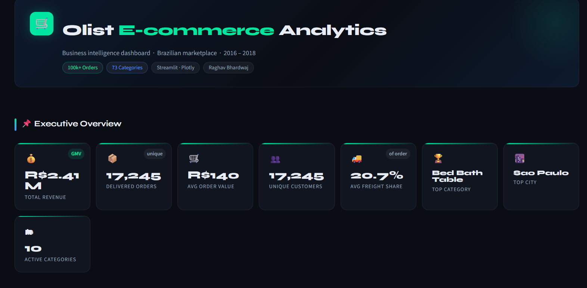
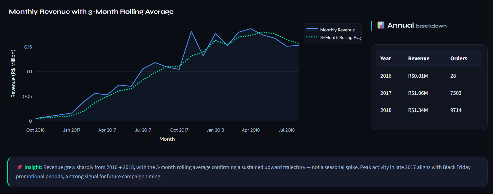
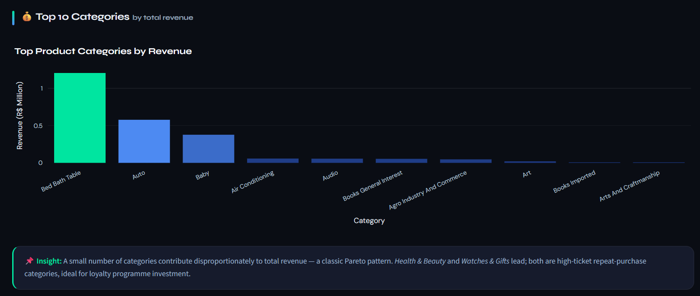
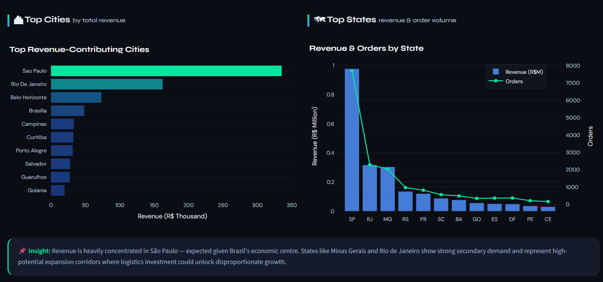

# 🛒 Olist Business Intelligence Dashboard

An interactive **Business Intelligence & Analytics Dashboard** built using **Streamlit, Plotly, Pandas, and Python** to analyze the real-world **Olist Brazilian E-commerce dataset** and generate actionable business insights across revenue, customer behaviour, pricing, freight costs, and geographic performance.

---

## 🚀 Live Dashboard

👉 [Open Live Streamlit Dashboard](STREAMLIT_LINK_HERE)

---

## 📌 Project Overview

Modern businesses generate massive amounts of transactional data — but raw data alone does not drive decision-making.

This project transforms the **Olist Brazilian E-commerce public dataset** into a professional analytics dashboard focused on:

- Revenue analysis
- Product category performance
- Pricing & freight optimization
- Geographic business insights
- Customer purchasing behaviour
- Business intelligence storytelling

The dashboard is designed with a **stakeholder-focused approach**, helping uncover insights that can support strategic decisions in e-commerce operations and growth.

---

# 📊 Dashboard Preview

## Executive Overview



---

## Revenue Trends & Insights



---

## Category & Pricing Analytics



---

## Geographic Business Insights



---

# 🎯 Business Problems Addressed

This dashboard helps answer key business questions such as:

✅ Which product categories drive the highest revenue?  
✅ How has revenue evolved over time?  
✅ Which states and cities contribute the most to sales?  
✅ How do freight costs affect order value?  
✅ What are the customer purchasing patterns?  
✅ Which regions indicate premium customer segments?  
✅ Where can pricing and logistics strategies be optimized?

---

# ✨ Key Features

- 📈 Revenue trend analysis with rolling averages
- 🛍️ Product category performance analytics
- 💰 Price & freight cost analysis
- 🌎 Geographic revenue intelligence
- 📦 Order distribution & outlier analysis
- 🔥 KPI overview cards
- 🎯 Business insights & recommendations
- 🌙 Professional dark-themed interactive UI
- ⚡ Responsive Streamlit dashboard

---

# 🧠 Key Insights Generated

### Revenue Growth
Revenue showed strong upward momentum from 2016 → 2018, indicating increasing marketplace adoption and customer activity.

### Category Intelligence
Bed Bath Table, Auto, and Baby categories emerged as major revenue contributors.

### Customer Behaviour
Most purchases cluster within lower price ranges, indicating price-sensitive buying patterns.

### Geographic Opportunities
Certain lower-volume states demonstrated higher average order values, suggesting premium customer segments beyond major urban regions.

### Logistics Impact
Freight costs vary significantly across categories and regions, highlighting opportunities for logistics optimization.

---

# 🛠️ Tech Stack

| Category | Technologies |
|---|---|
| Language | Python |
| Dashboard Framework | Streamlit |
| Data Processing | Pandas, NumPy |
| Visualization | Plotly |
| Statistical Analysis | Statsmodels |
| Deployment | Streamlit Community Cloud |

---

# 📂 Dataset

Dataset Used:
**Olist Brazilian E-commerce Public Dataset**

Source:
[Kaggle - Olist E-commerce Dataset](https://www.kaggle.com/datasets/olistbr/brazilian-ecommerce)

---

# 📁 Project Structure

```bash
olist-business-intelligence-dashboard/
│
├── app.py
├── requirements.txt
├── README.md
├── .gitignore
│
├── data/
│   ├── olist_orders_dataset.csv
│   ├── olist_order_items_dataset.csv
│   ├── olist_products_dataset.csv
│   ├── product_category_name_translation.csv
│   └── olist_customers_dataset.csv
│
├── assets/
│   ├── dashboard_preview_1.png
│   ├── dashboard_preview_2.png
│   ├── dashboard_preview_3.png
│   └── dashboard_preview_4.png
